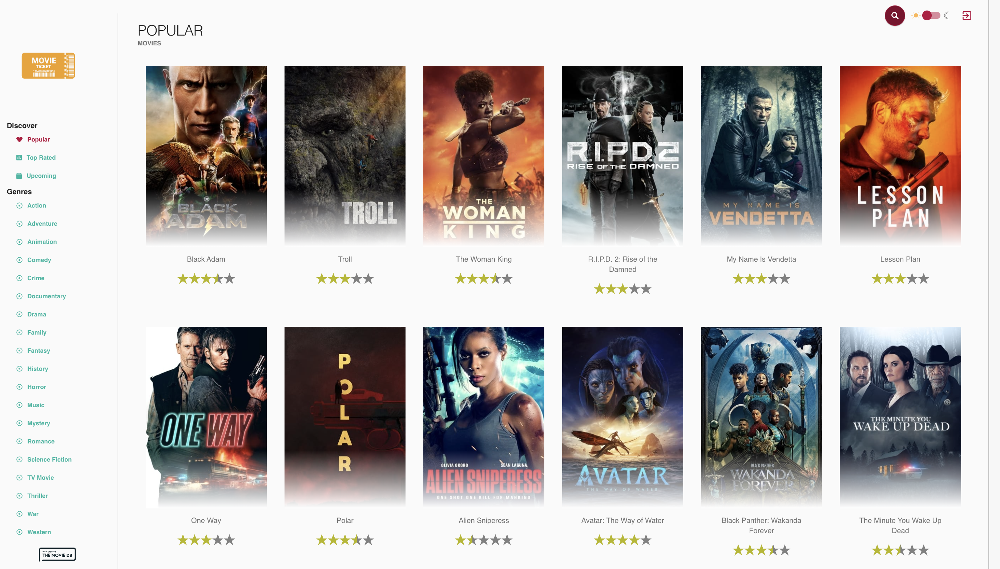
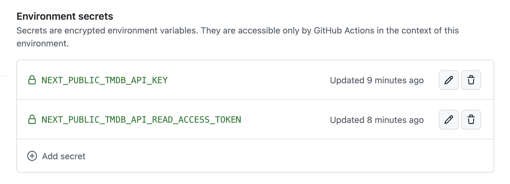
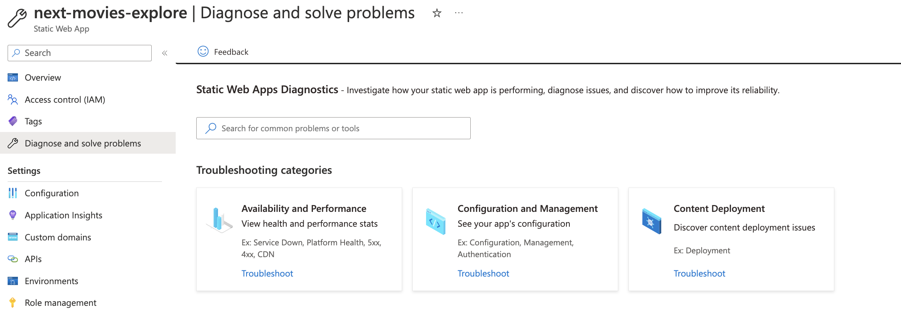
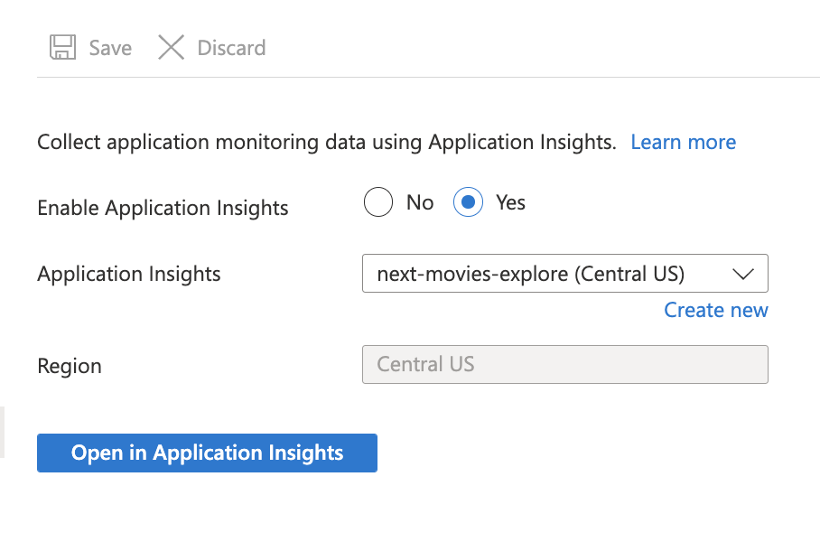
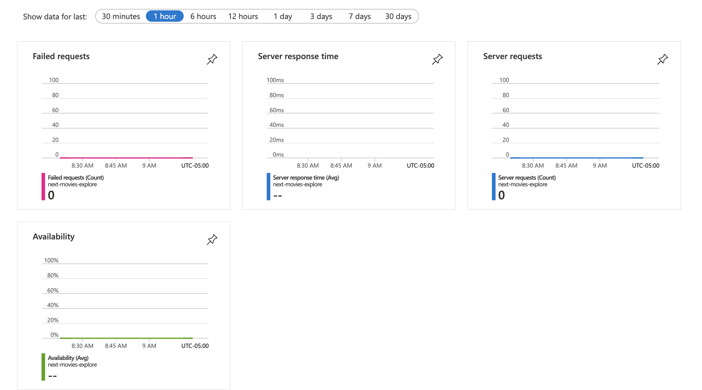
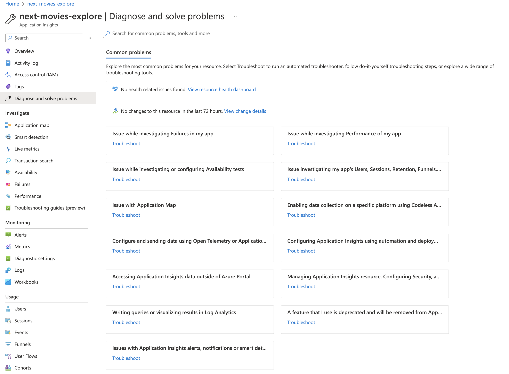

# Next.JS Movies Exploration

## Objectives

Explore the repo with three goals in mind:
 - Deploy the app to Azure Static Web Apps
 - Integrate e2e testing with Playwright
 - Deconstruct the app, and reconstruct using TDD

 Note - there are a couple of projects out there that combine Next.js and TMDB
 - [Taste.js Movies](https://tastejs.com/movies/)
 - [Next.js Movies ](https://github.com/transitive-bullshit/next-movie)

---

## Build / Deploy

Walking through default README.md instructions to validate existing application on my local dev environment.

### 1.1 Build The App

```bash
$ cd next-movies-explore
$ nvm use 16 
Now using node v16.18.0 (npm v8.19.2)
$ npm install
```

Resulted in errors: 
```
Found: react@17.0.2 
... 
Could not resolve dependency:
peer react@"^16.8.4" from react-select-search@2.2.4
...
npm ERR! Fix the upstream dependency conflict, or retry
npm ERR! this command with --force, or --legacy-peer-deps
npm ERR! to accept an incorrect (and potentially broken) dependency resolution.
```

Opted to use --legacy-peer-deps

```bash
$ npm install --legacy-peer-deps
```
### 1.2 Preview The App

Let's preview existing build:

```bash
$ npm run dev

> movie-app@0.1.0 dev
> next dev -p 8080

ready - started server on 0.0.0.0:8080, url: http://localhost:8080
```

This should give you something like this. The error message is because we have not set up the TMDB API yet - but it validates that build for the Next.js app works.


### 1.3 Deploy The App to SWA

Before we fix the TMDB API issue, let's first see if we can deploy this app _as is_ to Azure Static Web Apps.

_I'll use the VS Code approach for now, but may later delete resources and use the `swa deploy` option so we can establish a command-line step in `package.json` for future workshops or CI/CD needs_.

This sets up the [.github/workflows](../.github/workflows/azure-static-web-apps-lemon-ground-0d54e8a10.yml) file for automating build/deploy to Azure Static Web Apps. To learn what configuration options were used, see _this_ segment of the workflow.

```yml
# For more information regarding Static Web App workflow configurations, please visit: https://aka.ms/swaworkflowconfig
app_location: "/" # App source code path
api_location: "api" # Api source code path - optional
output_location: "" # Built app content directory - optional
```

The Workflow is set up to run on every commit (push) or PR (pull) request to the repo. 
> The actions status can be found [here](https://github.com/30DaysOf/next-movies-explore/actions/workflows/azure-static-web-apps-lemon-ground-0d54e8a10.yml)

Check VS Code Azure Extensions sidebar, or visit your [Azure Portal](https://portal.azure.com) page to determine the hosted URL for your web app.

> This app is hosted at [this URL](https://lemon-ground-0d54e8a10.2.azurestaticapps.net/)

In the initial run, you will see that the actions fail (for the same reason as our local build - the dependency resolution problem). How can we configure CI/CD to enforce this?

We'll use a hack [based on this GitHub issue discussion](https://github.com/npm/rfcs/discussions/283?sort=old) for now.  
 - Add an [`.npmrc`](./.npmrc) file to this project with `legacy-peer-deps=true`
 - Now `npm install` will just work without you having to explicitly setup options
 - Commit to GitHub, and this should now get enforced in the CI/CD process as well.

> Note that this solution is **NOT IDEAL**. The **right approach** would be to resolve the dependency conflicts by submitting issues to fix it upstream, or fork/fix-ing them in a local copy. Since this is just a demo project, I won't go that route yet.

### 1.4 Fix the TMDB Integration 

After the last step, you should see the [build/deploy action succeed](https://github.com/30DaysOf/next-movies-explore/actions/runs/3695032225) and the [website url should be live](https://lemon-ground-0d54e8a10.2.azurestaticapps.net/) **but there's a new problem**.

The site will now show a blank page (with a progress indicator) showing that it is waiting for something ... after a relevant timeout, you get a simple error message as shown below (with a 500: Internal Server Error in the console)

```html
Backend call failure
```

What's happening here? 

> It's likely because of the failure from the call to the TMDB API but we don't know yet (this is not a message from the codebase, so likely to be a message from SWA).

Let's see if we can setup the TMDB API integration, test it in our local preview, then commit changes - _and see if the error goes away_.

> STEP 1: Get a TMDB Account
 1. [Setup a TMDB Account](https://www.themoviedb.org/signup)
 2. [Look up your API Settings](https://www.themoviedb.org/settings/api) and note the following:
    - API Key
    - Read Access Token

> STEP 2: Configure local env variable settings

 - Copy [env.local.example](./.env.local.example) to [.env.local](.env.local) for env variables.
 - It has 2 env variables. Configure using API settings:
    - NEXT_PUBLIC_TMDB_API_KEY
    - NEXT_PUBLIC_TMDB_API_READ_ACCESS_TOKEN

Note that when you commit changes back to GitHub, this file will _not_ get committed, keeping your API secrets safe from public view.

> STEP 3: Preview locally to validate

Run the local dev server to see how the TMDB configuration changes the default view.

```bash
$ npm run dev
(base) nitya % npm run dev  

> movie-app@0.1.0 dev
> next dev -p 8080

ready - started server on 0.0.0.0:8080, url: http://localhost:8080
info  - Loaded env from /Users/nitya/Documents/GitHub/org-30daysof/next-movies-explore/.env.local

```
Here is what this looks like:



> STEP 4: Using env variables in CI/CD

GitHub Actions has support for:
 * configuring [environment variables](https://docs.github.com/en/actions/learn-github-actions/environment-variables#about-environment-variables) in workflows.
 * using [encrypted secrets](https://docs.github.com/en/actions/security-guides/encrypted-secrets) to store sensitive variables
 * setting [org-level secrets](https://docs.github.com/en/actions/using-workflows/sharing-workflows-secrets-and-runners-with-your-organization#sharing-secrets-within-an-organization) for reuse across projects.
 * using [environments for deployment](https://docs.github.com/en/actions/deployment/targeting-different-environments/using-environments-for-deployment)

We'll try the last option - effectively setting up a _deployment environment_ for a GitHub Actions workflow, to which we can add relevant environment variables _as secrets_ for secure storage and access.

1. Visit the [Environments](https://github.com/30DaysOf/next-movies-explore/settings/environments) page of your project settings, create a new environment. _I updated mine to "development" to provide context for its use as a development stage deployment target._ You can see [deployment history](https://github.com/30DaysOf/next-movies-explore/deployments) for each environment now.

2. Visit the created environment, and look for the `Environment secrets` section. Click `Add secret` and add two secrets corresponding to the above 2 variables (and their values) and save. _This should result in an Environment as follows ._

    

3. Update the GitHub Actions Workflow file for SWA to include the environment explicitly when defining the job parameters. Here is what that looks like:

```yml
    runs-on: ubuntu-latest
    environment: development
    name: Build and Deploy Job
```

Let's commit these changes and see if this helps resolve the previous server error. 

### 5. Troubleshooting Build/Deploy

> UPDATE: We still get the 'Backend call failure' page (reflects a 500 Internal Server Error). 

Let's take a look at [Troubleshooting deployment](https://learn.microsoft.com/en-us/azure/static-web-apps/troubleshooting) with SWA. It covers:
 - Backend environment variables (using App Settings)
 - Deployment errors (using GitHub Actions Logs)
 - Server errors (using Application Insights)

Note that environment variables required for [Build configuration](https://learn.microsoft.com/en-us/azure/static-web-apps/build-configuration?tabs=github-actions#environment-variables) are handled differently. The Application Settings (SWA) are primarily for configuring environment available to the backend API.

Since we set up the deployment environment previously, the runtime should have access to it. But looking at the build config, we also need to explicitly specify the _env_ variables accessible to the SWA deploy step. You can see the [GitHub Actions documentation](https://docs.github.com/en/actions/security-guides/encrypted-secrets#using-encrypted-secrets-in-a-workflow) for this as well.

```yml
env: # Add environment variables here
    NEXT_PUBLIC_TMDB_API_KEY: ${{ secrets.NEXT_PUBLIC_TMDB_API_KEY }}
    NEXT_PUBLIC_TMDB_API_READ_ACCESS_TOKEN: ${{ secrets.NEXT_PUBLIC_TMDB_API_READ_ACCESS_TOKEN }}
```

We can also add some logs above this step, to verify that those variables were defined in the environment for that job.

```yml
# Verify required env settings are defined
- name: Checks API KEY defined
run: |
    if [ "$NEXT_PUBLIC_TMDB_API_KEY" == ""]; then
    echo "TMDB API KEY NOT SET!" >> $GITHUB_OUTPUT
    fi
- name: Checks ACCESS TOKEN defined
run: |
    if [ "$NEXT_PUBLIC_TMDB_API_READ_ACCESS_TOKEN" == ""]; then
    echo "TMDB ACCESS TOKEN NOT SET!" >> $GITHUB_OUTPUT
    fi
```

---

## Troubleshooting on Azure

You can use front-end framework tooling, testing and other solutions to debug and troubleshoot your _front-end_ components and code. But how can you troubleshoot issues on the backend (in Azure)?

1. Visit the [Azure Portal](https://portal.azure.com). We can troublshoot in two ways.

2. First, you can select any existing deployed resource and look for the _Troubleshooting_ option specific to that service, in its sidebar menu. Here is what that looks like when I select the Azure Static Web Apps resource I am using for my hosting/deployment needs.

    


 3. Second, you can activate [Application Insights](https://learn.microsoft.com/en-us/azure/azure-monitor/app/app-insights-overview?tabs=net) for your project, allowing the backend to gather data from both the system (cloud) and your application (custom) for deriving insights and metrics related to performance, failures and more. Simply click the _Application Insights_ option in the sidebar menu to configure it as shown. 

    

    Select yes to activate, then wait till the "Open in Application Insights" button is enabled. Click to get the Application Insights dashboard below. 

    

    You can view _default metrics_ for the past hour, day, week, month etc. as shown. But you can also use this for custom insights or deeper dives (via activity logs and more). And, since App Insights is itself a resource,  you can also click _Troubleshooting_ in this page's sidebar, to diagnose and solve problems related to usage.
    

> Note: Each Azure service provides guidance on the types of metrics and insights you can obtain using Azure Monitor and related App Insights resources. [Here is the guidance for Azure Static Web Apps](https://learn.microsoft.com/en-us/azure/static-web-apps/monitor)
