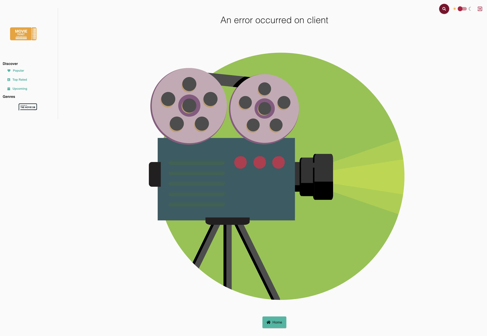

# Next.JS Movies Exploration

## Objectives

Explore the repo with three goals in mind:
 - Deploy the app to Azure Static Web Apps
 - Integrate e2e testing with Playwright
 - Deconstruct the app, and reconstruct using TDD

 Note - there are a couple of projects out there that combine Next.js and TMDB
 - [Taste.js Movies](https://tastejs.com/movies/)
 - [Next.js Movies ](https://github.com/transitive-bullshit/next-movie)

---

## Day 01: 

Walking through default README.md instructions to validate existing application on my local dev environment.

```bash
$ cd next-movies-explore
$ nvm use 16 
Now using node v16.18.0 (npm v8.19.2)
$ npm install
```

Resulted in errors: 
```
Found: react@17.0.2 
... 
Could not resolve dependency:
peer react@"^16.8.4" from react-select-search@2.2.4
...
npm ERR! Fix the upstream dependency conflict, or retry
npm ERR! this command with --force, or --legacy-peer-deps
npm ERR! to accept an incorrect (and potentially broken) dependency resolution.
```

Opted to use --legacy-peer-deps

```bash
$ npm install --legacy-peer-deps
```

Let's preview existing build:

```bash
$ npm run dev

> movie-app@0.1.0 dev
> next dev -p 8080

ready - started server on 0.0.0.0:8080, url: http://localhost:8080
```

This should give you something like this. The error message is because we have not set up the TMDB API yet - but it validates that build for the Next.js app works.



Before we fix the TMDB API issue, let's first see if we can deploy this app _as is_ to Azure Static Web Apps.

_I'll use the VS Code approach for now, but may later delete resources and use the `swa deploy` option so we can establish a command-line step in `package.json` for future workshops or CI/CD needs_.